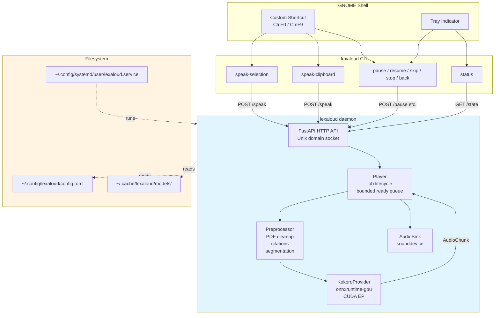

# Architecture

Lexaloud is three things loosely coupled by a Unix domain socket:

1. A **FastAPI daemon** running as a `systemd --user` unit that owns
   the TTS provider, the playback state machine, and the audio sink.
2. A **CLI** (`lexaloud`) that captures selection text and sends
   HTTP requests to the daemon.
3. A **GTK3 tray indicator + control window** for visual state
   feedback and voice/hotkey configuration.

The binding between them is intentionally thin so each piece can be
tested or replaced in isolation.

## Component diagram

## Data flow: a single `/speak` request

1. User selects text, presses the hotkey.
2. GNOME spawns `lexaloud speak-selection`.
3. CLI calls `wl-paste --primary` (or `xclip -o -selection primary`),
   reads the bytes, UTF-8-safe-truncates to `capture.max_bytes`.
4. CLI opens an httpx client bound to the Unix domain socket and POSTs
   `{"text": ..., "mode": "replace"}` to `/speak`.
5. Daemon's `/speak` handler:
   - Rejects null bytes → 400.
   - Rejects text > `capture.max_bytes` → 413.
   - Runs `preprocess()` to clean PDF artifacts, expand Latin
     abbreviations, and split into sentences.
   - Rejects any sentence > `MAX_SENTENCE_CHARS` → 400.
   - Calls `player.speak(sentences, mode="replace")`.
6. `Player.speak`:
   - Bumps the monotonic job ID (cancels any in-flight job).
   - Flushes the audio sink.
   - Resets `_pending`, starts fresh producer + consumer tasks.
7. **Producer task**: iterates `_pending`, calls
   `provider.synthesize()` for each sentence in a `ThreadPoolExecutor`,
   pushes `AudioChunk`s to the bounded `ready_queue`.
8. **Consumer task**: pulls `AudioChunk`s, writes them to the sink in
   `SUB_CHUNK_SECONDS`-long blocks, checking pause/cancel between
   blocks. Inserts a ~180 ms silence pad between sentences.
9. When `_pending` is empty, producer pushes a sentinel; consumer
   flushes the sink and transitions to `idle`.

## Key design choices

### Sentence granularity, not sample granularity

Streaming at the sentence level gives us clean pause/skip/back
semantics — we can't cleanly cancel a mid-word samples since Kokoro
emits a whole-sentence waveform in one call. Sub-chunk playback lets
us pause with ~100 ms latency without touching the synthesis pipeline.

### Bounded ready queue

`asyncio.Queue(maxsize=3)` between producer and consumer bounds
memory. When the user pauses, the producer blocks on `put()` after
the queue fills up, so any-length pause uses bounded RAM.

### Cooperative cancellation via job IDs

The provider takes `(sentence, job_id, is_current_job)` and checks
`is_current_job(job_id)` at key points. On `stop`/`skip`/`back` we
bump the job ID, and any in-flight provider calls return `None` after
their executor result comes back. This is robust under concurrent
HTTP requests without mid-call cancellation.

### Unix domain socket, not TCP loopback

The daemon binds `$XDG_RUNTIME_DIR/lexaloud/lexaloud.sock` via
systemd's `RuntimeDirectory=lexaloud` + `RuntimeDirectoryMode=0700`.
Only the owner user's processes can reach it. There's no port to
firewall, no cross-user attack surface, and no local "anyone on
127.0.0.1 can spam /speak" footgun.

### onnxruntime-gpu with CUDA EP, preload_dlls upfront

Spike 0 discovered that without `onnxruntime.preload_dlls(cuda=True,
cudnn=True)` the CUDA EP silently falls back to CPU on Ubuntu 24.04
with the pip NVIDIA wheels. The provider calls `preload_dlls` before
session construction AND verifies `session.get_providers()` actually
contains `CUDAExecutionProvider` post-build — silent-degradation
detection, per the audit.

## What's NOT in the daemon

- **No audio mixing** — we own the stream, single producer, single
  sink. Other processes get exclusive access to the PortAudio device
  only when the daemon is actively playing; the sink opens on first
  write and closes on sentinel.
- **No session persistence** — `/state` is ephemeral. Restart the
  daemon and you lose your current queue. This is intentional for
  v0.1.0; v0.2 may add resume-on-restart.
- **No remote control** — the daemon only listens on UDS.
- **No multi-user** — the daemon is a `systemd --user` service, one
  instance per user.

## See also

- `docs/design-rationale.md` — why these design choices, with pointers
  to Spike 0 findings.
- `docs/http-api.md` — HTTP endpoint reference.
- `docs/models.md` — Kokoro model provenance and the ONNX Runtime
  coexistence landmine.
